# Car price

In this project, first we look at the associations of the price of vehicles with predictors using Multiple Linear Regression. Secondly, we select the best prediction model to predict the car price. (Final prediction model is Random Forest)

Dataset can be found [here](https://www.kaggle.com/datasets/antfarol/car-sale-advertisements).

* car: manufacturer brand
* price: seller’s price in advertisement (in USD)
* body: car body type
* mileage: as mentioned in advertisement (‘000 Km)
* engV: rounded engine volume (‘000 cubic cm)
* engType: type of fuel (“Other” in this case should be treated as NA)
* registration: whether car registered in Ukraine or not
* year: year of production
* model: specific model name
* drive: drive type

Car dataset contains the price of vehicles for 9,576 vehicles and 9 predictors. Data set two predictors that contains NA's. Used Random Forest for the imputation of NA's.

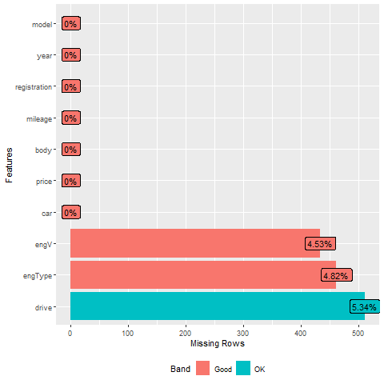

### Multiple Linear Regression

Used multiple linear regression to find associations between the car price and predictors. 

#### Exploratory data analysis

Scatter plot the car price is skewed to the right. (Logarithm transformation may be useful)

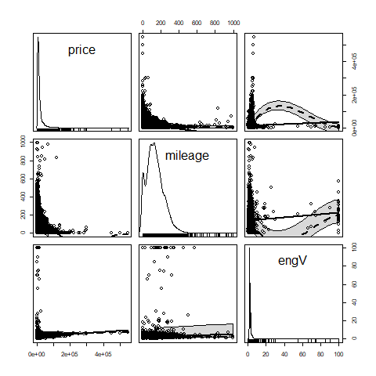

The car body type hatch has the smallest log `Price`. The plot in the bottom right shows the relationship between the `drive` type and log `Price` within the type of fuel (`engType`).

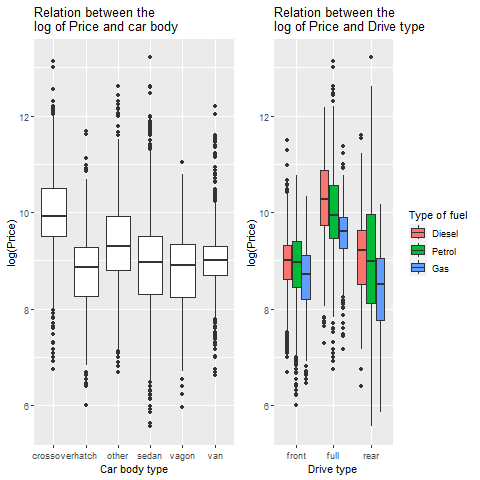

Added Variables plots partial regression to find important predictors.

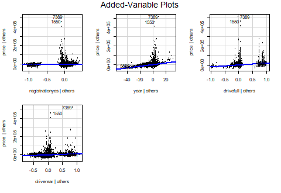

### Assumptions of Multiple Linear Regression

There is a violation of the normality assumption. The QQ-plot shows the residuals point deviating at tail end. 
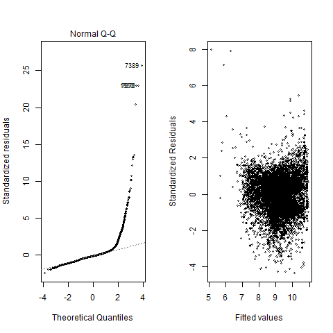

### Transformations

Used power transformation on predictors then response. 

Note: Add small constant to `mileage` to use the power transformation function since some values are zero.

The transformed predictors are $(engV)^{(-0.5)}$ and $\sqrt{mileage}$.

Using the `powerTranformations()` the optimal lambda is -0.05 for `price` response. However, used log transformation for easier interpretation. 

### Assumptions of Transformed model

Check for multicollinearity: VIF are less than 5 for all values. No issue with multicollinearity.

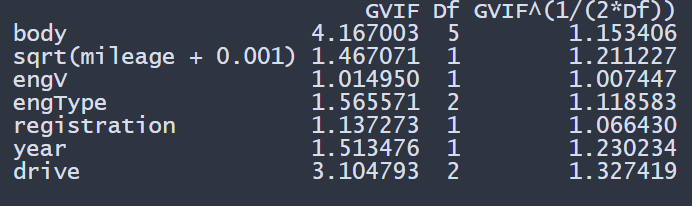

Standardize residuals vs year plot: no residual patterns through the  years
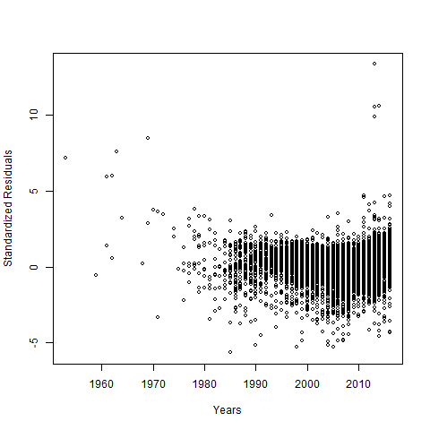

QQplot: Data points deviate at the end of tails
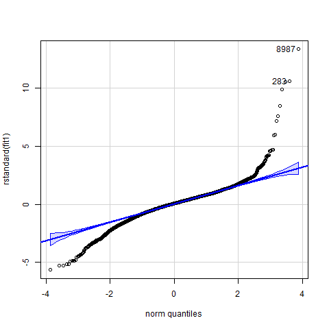

Check for outliers & leverage points: From the standardize residuals vs leverage plot, there are 7 bad leverage points.

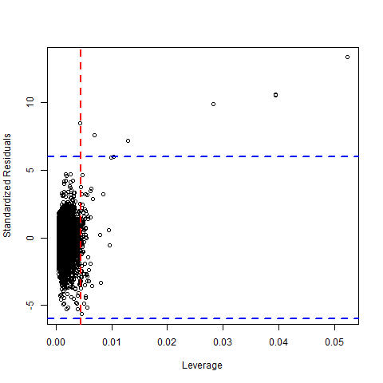

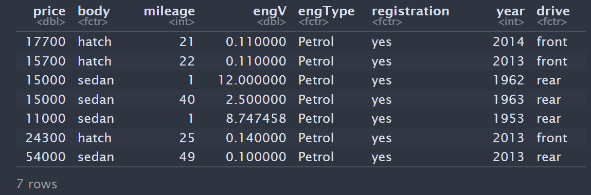

From the cooks distance plot there are 521 influential data points. There are many influential points. Run model with and without influential data points.
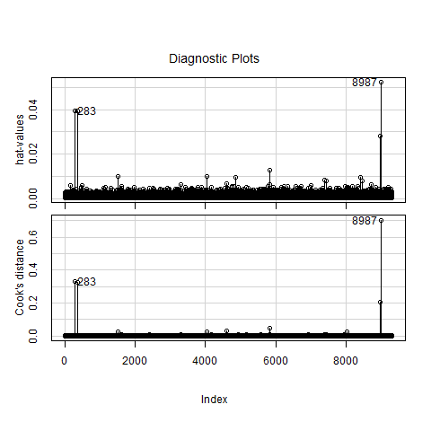

### Assumption plots without the influential points

Standardize residuals vs year plot: no residual patterns through the years without the influential data points
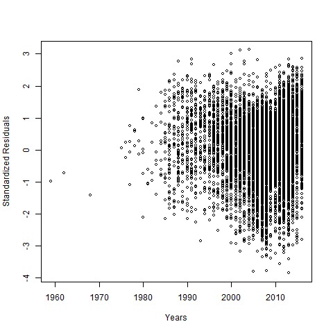

The assumption for normality looks better than model with all data
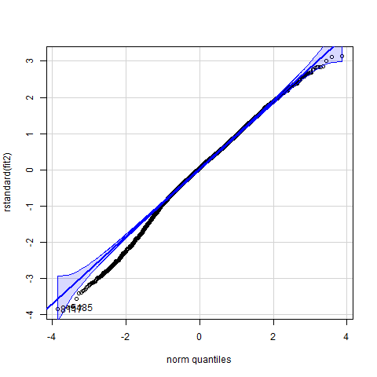

The assumption for constant variance is satisfied.
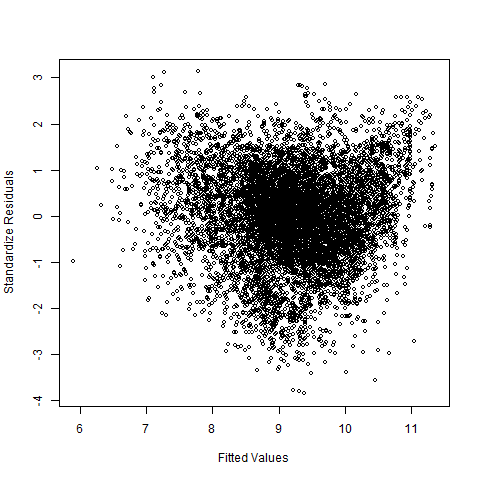

Report both model with and without influential data points since there is clearly a change in the assumptions.

Summary: The adjusted R-squared is 0.7044 for the first model that contain all data. About 70% of the variability can be explain by the model that contains all data compare to 85.08% without the influential data points. 

For the interpretations will used the first model.

The price of a car that uses Gas is 29.99% less, on average, than a car that uses diesel, when all other variables in the model are held constant.

The price of a car that full wheel drive is 85.69% more, on average, than a car that is front wheel drive, when all other variables in the model are held constant.

## Predictions 

Train linear regression, lasso regression, and random forest model to find the best prediction model. Did a 70/30 split for train and test sets. 

Ran the multiple models at the same time on the training data using `doparalell`.

Performed 10 fold cross validation. Results below show the Random forest is the better model for predictions with the lowest Root Mean Square Error (RMSE), Mean Absolute Error (MAE) and highest adjusted R-square on the training on the training data set.  

* result 1 - Lasso regression
* result 2 - Multiple linear regression
* result 3 - Random forest 
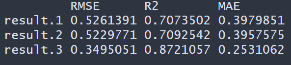

Using the Random Forest for prediction on the test data set. The models RMSE is 8407.9 and MAE is 3589.3. Meaning on average the Random Forest model prediction of the price of the car is off by \$3575.62.

